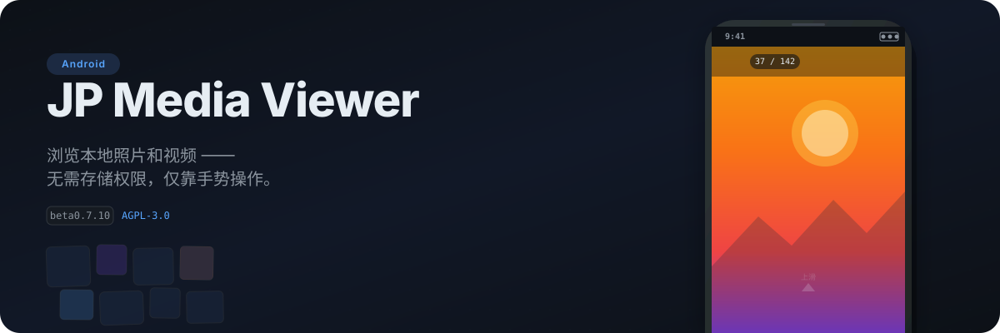

<p align="center">
  
</p>

> 本项目全程由 AI 辅助完成 —— 包括代码实现、文档编写、CI/CD 配置与版本发布管理。

一款手势驱动的 Android 本地媒体浏览器。通过系统文件选择器（SAF）添加本地文件夹，自动扫描其中的照片和视频，以随机排序的方式呈现 —— **全程无需请求任何存储权限**。

<br>

<p align="center">
  
</p>

### 📁 智能扫描

| | 功能 | 说明 |
|---|---|---|
| 🔌 | **SAF 文件夹选择** | 通过系统文件选择器添加文件夹，无需 `READ_EXTERNAL_STORAGE` |
| ⚡ | **自动扫描与缓存** | 递归扫描子目录，扫描结果以 JSON 缓存；文件无变化时秒开 |
| ⏸️ | **暂停 / 继续扫描** | 扫描中可随时暂停，进度自动保存，后续可断点续扫 |
| 🚫 | **.nomedia 支持** | 可选择是否遵守 `.nomedia` 文件过滤规则 |
| 📊 | **扫描统计** | 每个文件夹独立统计：检查文件数、媒体数、跳过目录数、失败目录、耗时 |

### 👆 手势浏览

| | 功能 | 说明 |
|---|---|---|
| ⬆️ | **上滑** | 切换到下一张 |
| ⬇️ | **下滑** | 切换到上一张 |
| 👆 | **单击** | 显示 / 隐藏控制栏 |
| 🔍 | **双指缩放** | 1x–4x 缩放，放大后可拖动查看细节 |
| 🔄 | **双击** | 放大 / 还原图片 |

### ▶️ 视频播放

| | 功能 | 说明 |
|---|---|---|
| 🎬 | **ExoPlayer 引擎** | 单实例复用，开销极小 |
| ⏯️ | **播放 / 暂停** | 点击即切 |
| ⏪ | **进度拖动** | 可拖拽进度条 |
| 🔇 | **静音切换** | 设置持久化保存 |
| 🔁 | **自动循环** | 默认无限循环播放 |

### ❤️ 收藏与整理

| | 功能 | 说明 |
|---|---|---|
| ⭐ | **收藏 / 取消收藏** | 点击心形按钮即可操作，收藏状态持久保存 |
| 🔖 | **仅浏览收藏** | 首页可进入只浏览已收藏媒体的模式 |
| 📂 | **子文件夹模式** | 只看当前文件所在子文件夹的媒体 |
| 🔄 | **子文件夹排序** | 支持按文件名、大小、随机排序，正序 / 逆序切换 |

### 🚀 快捷操作

| | 功能 | 说明 |
|---|---|---|
| 🔢 | **快速跳转** | 点击顶部序号（如「37 / 142」）可输入编号直接跳转 |
| 📤 | **分享** | 长按媒体可分享到其他应用 |
| 🔗 | **用其他应用打开** | 长按后选择外部应用打开 |
| ℹ️ | **文件详情** | 查看文件名、日期、大小、所属文件夹、收藏状态 |

### 🎨 界面与体验

| | 功能 | 说明 |
|---|---|---|
| 🎭 | **Material You** | Android 12+ 支持莫奈动态取色；低版本使用自定义蓝灰主题 |
| 🌑 | **纯黑沉浸模式** | 全黑背景，OLED 屏幕友好 |
| 🔮 | **预测式返回** | Android 14+ 完整跨屏预览动画；低版本优雅降级 |
| 🔄 | **随机浏览** | 每次浏览都重新随机排序，避免首项重复 |

<br>

<p align="center">
  
</p>

1. **打开应用**，点击「添加文件夹」
2. **选择一个**包含照片或视频的目录，授予读取权限
3. **等待扫描完成**（可随时暂停，进度自动保存）
4. **点击「开始浏览」** 进入随机浏览模式
5. **用手势操控** —— 上滑 / 下滑 / 单击 / 双指缩放，自在随心

> 💡 扫描结果会缓存在本机。下次打开同一组文件夹，无需重新扫描，秒开即用。

### 手势速查

| 操作 | 效果 |
|---|---|
| 单击 | 显示 / 隐藏顶部和底部控制栏 |
| 上滑 | 下一张 |
| 下滑 | 上一张 |
| 双击图片 | 放大 / 还原 |
| 双指缩放 | 缩放图片（1x–4x）|
| 点击 ❤️ | 收藏 / 取消收藏 |
| 点击筛选按钮 | 只看当前子文件夹 / 返回全部 |
| 点击序号 | 输入编号跳转到指定项 |
| 长按 | 查看文件详情、分享、用其他应用打开 |
| 视频控制栏 | 播放 / 暂停、拖动进度条、静音切换 |

### 收藏

- 浏览页底部 ❤️ 可收藏或取消收藏当前媒体。
- 首页「查看收藏」只显示已扫描目录中仍可访问的收藏媒体。
- 如果收藏文件已被删除或文件夹授权失效，应用会给出明确提示。

<br>

<p align="center">
  
</p>

## 下载

最新 Release APK 使用稳定签名。**beta0.0.8 及之后的 release 签名版本**可直接覆盖安装。

## 构建

```bash
# 进入 android 目录
cd android

# 调试构建（无需签名）
./gradlew assembleDebug              # Linux / macOS
.\gradlew.bat assembleDebug          # Windows

# 构建产物：
#   android/app/build/outputs/apk/debug/jp-media-viewer-{版本号}-debug.apk
#   android/app/build/outputs/apk/release/jp-media-viewer-{版本号}-release.apk（需签名）
```

| 层级 | 技术选型 | 版本 |
|---|---|---|
| **开发语言** | Kotlin | 1.9.22 |
| **UI 框架** | Jetpack Compose + Material3 | BOM 2024.02.00 |
| **图片加载** | Coil | 2.5.0 |
| **视频播放** | Media3 / ExoPlayer | 1.2.0 |
| **文件访问** | Storage Access Framework（SAF）| — |
| **数据存储** | SharedPreferences + JSON 缓存 | — |
| **构建系统** | Gradle + Kotlin DSL | AGP 8.2.2 |
| **最低 / 目标 SDK** | Android 8.0 (26) / Android 14 (34) | — |
| **测试框架** | JUnit + Robolectric | 4.13.2 / 4.11.1 |

## 路线图

- [ ] **全局排序模式** —— 不只随机，支持按文件名、日期、文件夹排序 【高】
- [ ] **HEIC / AVIF 格式支持** —— 识别并渲染现代图片格式 【高】
- [ ] **多级子文件夹导航** —— 面包屑式的层级目录选择 【中】
- [ ] **视频播放行为可配置** —— 自动播放 / 点击播放开关、循环次数 【中】
- [ ] **收藏管理增强** —— 批量取消收藏、失效收藏筛选、按文件夹筛选 【中】
- [ ] **多文件夹分组浏览** —— 按来源文件夹分组浏览 【中】
- [ ] **音量和播放速度控制** —— 0.5x–2x 倍速、音量滑块 【中】
- [ ] **边缘预览** —— 屏幕边缘显示前后缩略图预览 【低】
- [ ] **国际化** —— 英文等多语言支持 【低】
- [ ] **完整文件名显示** —— 长文件名 tooltip 或长按展开 【低】
- [ ] **无障碍优化** —— 为所有交互元素添加内容描述 【低】
- [ ] **崩溃上报** —— 集成崩溃收集机制 【低】
- [ ] **自动重试** —— 媒体加载失败时自动尝试刷新 【低】

## 许可

本项目采用 [GNU Affero General Public License v3.0](LICENSE) 发布。

```
SPDX-License-Identifier: AGPL-3.0-only
```
